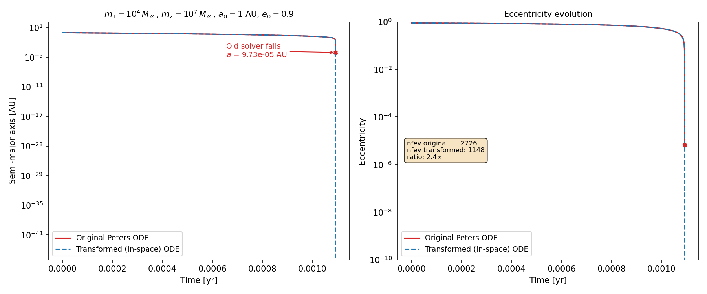

# GWintegrator

## Introduction

GWintegrator is a Python package for computing the orbital evolution of gravitationally bound binary systems approaching merger.
It transforms the orbital equations based on [Peters (1964)](https://link.aps.org/doi/10.1103/PhysRev.136.B1224) to achieve more stable numerical integration.
Unlike other methods that focus solely on merger time, GWintegrator provides the orbital evolution—allowing you to determine the orbital configuration (semi-major axis and eccentricity) at any time before merger. These equations are based on the work in the research note.

## Equations

Given the initial conditions for separation ($a_0$) and eccentricity ($e_0$), the orbital evolution is computed using the following equations:

$$\frac{d\tau}{ds} = \exp(-4s) \frac{(1-e^2)^{7/2}}{G(e)}$$

$$\frac{dl}{ds} = -\frac{19}{12} \left(1-e^2\right)\frac{F(e)}{G(e)},$$

where $s$ is the independent variable defined as $s = \ln(a/a_0)$, $l=\ln(e)$, and $\tau = t/t_0$.
We define $t_0$ as:

$$t_0=\frac{5}{64}\frac{c^5a_0^4}{G^3(m_1+m_2)m_1m_2},$$

where $c$ is the speed of light, $G$ the gravitational constant, and $m_1$ and $m_2$ the respective masses of the compact objects.

For convenience, we have set:

$$
G(e)=1+ \frac{73}{24}e^2 + \frac{37}{96}e^4,
$$

and

$$
F(e)=1+ \frac{121}{304}e^2
$$


## Installation instructions

**Via pip:**

```bash
pip install gw-integrator
```

**Via GitHub:**

```bash
pip install git+https://github.com/maxbriel/GW-integration.git
```

## How to use

### General case

**Step 1: Import the integrator**

```python
from GWintegrator import GWintegrator
```

**Step 2: Define your binary system parameters**

Specify the masses of both objects (in solar masses), the initial semi-major
axis (in AU), and the initial eccentricity:

```python
m1 = 100  # Primary mass in Msun
m2 = 100  # Secondary mass in Msun
a0 = 0.01  # Initial semi-major axis in AU
e0 = 0.43  # Initial eccentricity (between 0 and 1)
```

**Step 3: Create an integrator instance and compute the orbital evolution**

Initialize the `GWintegrator` object with your parameters and call
the `integrate()` method to compute the complete orbital evolution until merger:

```python
integrator = GWintegrator(m1, m2, a0, e0)
integrator.integrate()

# Get the merger time
print(integrator.merger_time)
```

**Step 4: Query orbital parameters at specific times**

You can retrieve the semi-major axis and eccentricity at any time before merger
by calling the integrator with an array of times (in years):

```python
t = [1e3, 1e4, 1e5, 1e7]  # Times in years
a, e = integrator(t)
```
This will run the integration using the maximum time (`t_max`) in the array (1e7 years in the example)
and return the orbital parameters at the specified times based on the `dense_output` from
`solve_ivp`. If the system merges before reaching `t_max`, orbital values with times
after the merger time will return `np.nan`.

### Available Methods and Properties

Once you've created and integrated a `GWintegrator` object, you can access the following methods and properties:

**`integrate()`** — Computes the orbital evolution of the binary system from the initial conditions until merger.

**`solution`** — The raw solution object returned by `scipy.integrate.solve_ivp`. Contains all interpolation data and can be called like a function to retrieve `(tau, l)` at specified $s$ values.

**`time_array_yr`** — Returns a NumPy array of time values (in years) where the solution was evaluated.

**`separation_array_AU`** — Returns a NumPy array of semi-major axis values (in AU) corresponding to the time array.

**`eccentricity_array`** — Returns a NumPy array of eccentricity values corresponding to the time array.

**`merger_time_yr`** — Returns the time (in years) at which the merger occurs. Only available after calling `integrate()` or having called the integrator. If the system has not yet merged within the integration time, this will raise an error.

Additional methods are available to retrieve the solutions in other parameter spaces, i.e. $\alpha$ space.


## Benchmarks

We benchmark GWintegrator against two references across a range of compact binary systems:

1. **Analytical merger time** from Peters (1964) — used to verify accuracy.
2. **Direct (non-transformed) ODE solver** — integrates the original Peters equations $da/dt$ and $de/dt$ in physical space, serving as the baseline.

The benchmarks compare three quantities: merger time accuracy, solver convergence, and number of ODE right-hand-side evaluations (`nfev`).

### Test cases

| # | $m_1\,[M_\odot]$ | $m_2\,[M_\odot]$ | $a_0\,[\mathrm{AU}]$ | $e_0$ | System type |
|---|---:|---:|---:|---:|---|
| 1 | 30 | 10 | 0.05 | 0.0 | BH–BH, circular |
| 2 | 30 | 10 | 0.01 | 0.5 | BH–BH, moderate $e$ |
| 3 | 30 | $10^4$ | 0.01 | 0.9 | BH–IMBH, high $e$ |
| 4 | 3 | $10^7$ | 0.01 | 0.1 | NS–SMBH |
| 5 | $10^4$ | $10^7$ | 1.0 | 0.9 | IMBH–SMBH, high $e$ |
| 6 | 0.3 | 0.5 | $10^{-4}$ | 0.9 | WD–WD, high $e$ |

### Merger time accuracy

The analytical merger time is given by Peters (1964) Eq. 5.14. For circular orbits this reduces to the closed-form expression:

$$T_{\rm merger} = \frac{a_0^4}{4\,\beta}, \quad \beta = \frac{64}{5}\frac{G^3 m_1 m_2 (m_1+m_2)}{c^5}$$

For eccentric orbits the merger time requires a numerical integral:

$$T_{\rm merger} = \frac{12}{19}\frac{c_0^4}{\beta} \int_0^{e_0} \frac{e^{29/19}\left(1 + \frac{121}{304}e^2\right)^{1181/2299}}{(1-e^2)^{3/2}}\,de$$

where $c_0 = a_0\,(1 - e_0^2)\,e_0^{-12/19}\left(1 + \frac{121}{304}e_0^2\right)^{-870/2299}$.
The three methods are in agreement with one another.

### Convergence

The original Peters ODE solver fails to converge on **all test cases** — `scipy.integrate.solve_ivp` reports *"Required step size is less than spacing between numbers"*, indicating that the adaptive stepper cannot resolve the singularity as $a \to 0$. The transformed (ln-space) solver successfully reaches merger on every case.

### Function evaluations

Using identical tolerances (`rtol = atol = 1e-12`), the transformed solver requires significantly fewer ODE evaluations:

| # | `nfev` original | `nfev` transformed | ratio |
|---|---:|---:|---:|
| 1 — BH–BH circular | ~2200 | ~640 | ~3.4× |
| 2 — BH–BH $e=0.5$ | ~2400 | ~660 | ~3.6× |
| 3 — BH–IMBH $e=0.9$ | ~2760 | ~1150 | ~2.4× |
| 4 — NS–SMBH $e=0.1$ | ~2250 | ~630 | ~3.6× |
| 5 — IMBH–SMBH $e=0.9$ | ~2730 | ~1150 | ~2.4× |
| 6 — WD–WD $e=0.9$ | ~2770 | ~1150 | ~2.4× |

The reduction in function evaluations is approximately **3 to 4 times** compared to the original equations at `rtol = atol = 1e-12`.

### Orbital evolution

The figure below illustrates the difference in orbital evolution. Both solvers agree closely throughout most of the inspiral. The original solver abruptly stops at a non-zero separation (red x), while the transformed solver continues (blue dashed line).




## Caveats

- Cannot handle e=0, instead a small offset (machine precision offset) is added.
